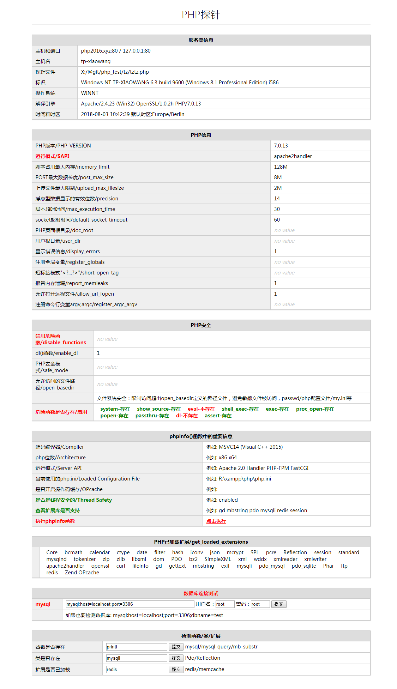

# php探针

php探针 php环境侦测 php Environmental detector

- http://qingmvc.com
- http://qingcms.com
- http://logo234.com  
- http://mangdian.net  

# 轻量级，主要目的

- **列出phpinfo()的重要信息**
- 检测危险函数是否开启
- 检测函数/类/扩展是否支持
- 检测数据库连接
- 检测php.ini运行时配置情况

# 截图 screenshot

